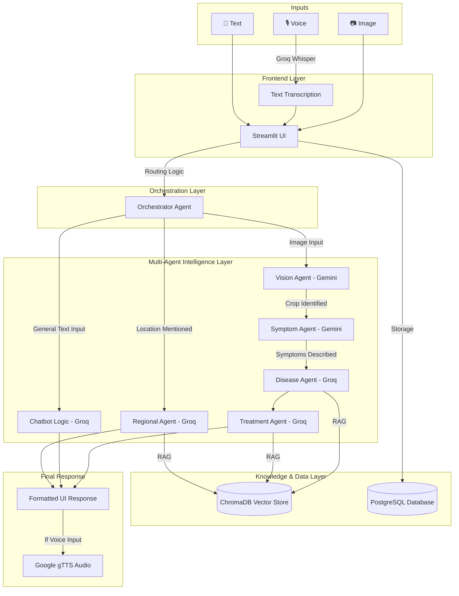

# 🧠 CropCare AI Architecture Documentation

This document provides a deep dive into the internal architecture of the CropCare AI system, explaining the data flow for different input types and the multi-agent orchestration.

---

## 🎨 System Architecture Overview

The system is built on a **Modular Multi-Agent Architecture** that separates visual perception from logical reasoning and specialized knowledge retrieval.

---

## 🧑‍💻 The Multi-Agent System

### 1. Vision Agent (Google Gemini 2.5 Flash)
*   **Role**: Primary visual identifier.
*   **Responsibility**: Analyzes the raw image to determine if a supported crop is present.
*   **Output**: Crop name and detection confidence.

### 2. Symptom Agent (Google Gemini 2.5 Flash)
*   **Role**: Visual diagnostician.
*   **Responsibility**: Performs fine-grained analysis of leaf health, looking for lesions, spots, or discoloration.
*   **Output**: A descriptive text summary of the visual symptoms.

### 3. Disease Agent (Groq Llama 3.1 8B)
*   **Role**: Diagnostic brain.
*   **Responsibility**: Takes the crop name and symptoms, then queries the **Disease Knowledge Base (RAG)** to find a match in the PlantVillage dataset.
*   **Output**: Final disease diagnosis with reasoning.

### 4. Treatment Agent (Groq Llama 3.1 8B)
*   **Role**: Agricultural expert.
*   **Responsibility**: Fetches verified treatment protocols (organic and chemical) and safety precautions from the knowledge base.
*   **Output**: Actionable treatment steps.

### 5. Regional Agent (Groq Llama 3.1 8B)
*   **Role**: Localized advisor.
*   **Responsibility**: Triggered when a location is detected. It uses the **Regional Knowledge Base** to provide soil and climate-specific advice.
*   **Output**: Localized crop recommendations and alerts.

---

## 🔄 Input-Specific Data Flows

### 📷 The Image Pipeline
1.  User uploads an image.
2.  `Orchestrator` triggers `Vision Agent` -> `Symptom Agent` -> `Disease Agent`.
3.  `Disease Agent` performs a similarity search in **ChromaDB**.
4.  `Treatment Agent` generates the final plan.

### 🎙️ The Voice Pipeline
1.  Audio is captured in the UI.
2.  **Groq Whisper v3** transcribes the audio based on the user's selected language.
3.  The transcription is routed either to the `Regional Agent` (if a location is found) or the `General Chat` logic.
4.  **Google gTTS** converts the final response back to audio.

### 📝 The Text Pipeline
1.  User types a query.
2.  `Regional Agent` scans for geographical keywords.
3.  If agricultural, it pulls from `Regional RAG`.
4.  Otherwise, the `Groq Llama` model responds using conversation history.

---

## 🗄️ Knowledge Base (RAG)
The system uses **Retrieval-Augmented Generation** to prevent hallucinations. All scientific data about diseases and regional statistics are stored as vector embeddings in **ChromaDB**, ensuring that every answer is grounded in real agricultural data.
