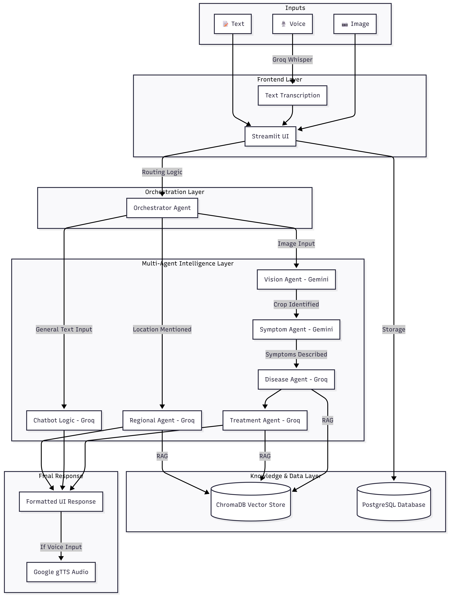

# 🏗️ Architecture Design & Production Readiness

## 🖼️ System Architecture
CropCare AI is built on a high-performance multi-agent framework. Below is the conceptual diagram of the system flow:

---

## 📊 System Components

### 1. Multi-Agent Pipeline
The core logic resides in `src/orchestrator.py`, which coordinates a sequential chain of specialized AI agents:
*   **Vision Agent**: Performs crop detection and disease symptom identification.
*   **Symptom Agent**: Generates a detailed natural language description of observed issues.
*   **Disease Agent**: Matches symptoms to a specific disease using RAG and local knowledge.
*   **Treatment Agent**: Recommends chemical and organic treatment protocols.
*   **Regional Agent**: Injects geographical context (weather, soil, and local alerts).

### 2. Logging & Observability
*   **Centralized Logging**: Managed via `src/logger.py`.
*   **Audit Trails**: Every login, diagnostic attempt, and safety violation is logged to `debug.log` for monitoring and debugging.

### 3. Performance & Caching
*   **Streamlit Caching**: `st.cache_data` is used for RAG index loading and metadata generation to ensure sub-second response times for repeat queries.
*   **Voice Optimization**: Audio generation (TTS) is lazy-loaded to save processing bandwidth.

---

## 🔄 Data Flow
1.  **Input Phase**: User submits Image, Text, or Voice data.
2.  **Security Layer**: Rate Limiter and Safety Interceptor validate the request.
3.  **Analysis Phase**: The Orchestrator triggers the agent pipeline in sequence.
4.  **Synthesis Phase**: Results are validated against Pydantic schemas.
5.  **Persistence Phase**: Conversations are saved to PostgreSQL.
6.  **Output Phase**: Final response is delivered via UI and Voice.

---

## 🛡️ Production Readiness Audit (12 Pillars)

The following controls have been implemented to ensure the system is production-grade:

1.  **Deterministic Safety Checks**: Keyword and LLM-based filtering in `src/safety.py`.
2.  **Async AI Clients**: Modular factory pattern for non-blocking AI calls.
3.  **Schema Validation**: Strict data integrity using **Pydantic** models.
4.  **Shared Secret Gatekeeping**: `APP_SECRET` required for new user registration.
5.  **Generic Error Messages**: User-facing exceptions are sanitized to hide internal logic.
6.  **Persistent DB State**: PostgreSQL integration for reliable chat history.
7.  **Agent Loop Safeguards**: `MAX_STEPS` limit to prevent logic recursion.
8.  **Context Window Management**: History slicing and summarization to manage token budgets.
9.  **Per-User Rate Limiting**: sliding-window 10 requests/min limit in `src/rate_limiter.py`.
10. **SQL Sanitization**: 100% parameterized queries via SQLAlchemy.
11. **Media Lifecycle Cleanup**: Automatic purging of temp files via `src/cleanup.py`.
12. **Singleton/Factory Patterns**: Efficient resource management in `src/factory.py`.
