# docs/architecture.md

# 🏛️ CropCare AI — Detailed System Architecture

CropCare AI is designed as a secure Hybrid Multimodal Agricultural Intelligence Platform with layered perception, reasoning, localization, observability, and multilingual interaction capabilities.

CropCare AI is a Hybrid Multimodal Agricultural Intelligence System designed using layered AI orchestration principles.

The architecture combines:

* Deep Learning Computer Vision
* Multimodal Vision Intelligence
* Cognitive LLM Reasoning
* Retrieval-Augmented Generation
* Regional Agricultural Intelligence
* Production-Grade Observability

---

# 🌱 High-Level Architecture Philosophy

Traditional agricultural AI systems often rely entirely on a single LLM.

This creates several problems:

❌ weak visual classification
❌ hallucinated diagnoses
❌ inconsistent treatment generation
❌ poor explainability

CropCare AI solves this by separating:

| Intelligence Layer | Responsibility                       |
| ------------------ | ------------------------------------ |
| Perception Layer   | Visual disease recognition           |
| Translation Layer  | Image-to-text symptom conversion     |
| Reasoning Layer    | Disease verification and explanation |
| Knowledge Layer    | RAG-based factual grounding          |
| Advisory Layer     | Regional adaptation and treatment    |

---

# 🧠 Full Hybrid Pipeline Architecture
<<<<<<< HEAD

=======


>>>>>>> fac58ab60224e1ced40b2293194c9b8e0c9024a8
# 👁️ Deep Learning Perception Layer

## MobileNetV2 CNN Classifier

### File

```text
src/disease_classifier.py
```

### Responsibilities

The CNN classifier is responsible for:

* crop classification
* disease recognition
* confidence estimation
* fast local inference

Unlike LLMs, CNNs are specialized for:

✅ visual feature extraction
✅ spatial pattern learning
✅ image classification

---

## Why CNN Instead of Pure LLM Vision?

LLMs are excellent at:

* reasoning
* explanation
* summarization
* language synthesis

However, specialized CNNs outperform LLMs for:

* fine-grained plant disease classification
* lesion pattern recognition
* visual agricultural pathology

This is why CropCare AI separates:

```text
Perception ≠ Reasoning
```

---

# 🌉 Multimodal Translation Layer

## Gemini Symptom Agent

### File

```text
src/symptom_agent.py
```

### Purpose

Groq Llama models are text-only systems.

Therefore, Gemini Vision acts as a multimodal translator that converts:

```text
Image → Structured Agronomic Symptoms
```

Example:

```text
Brown necrotic lesions with yellow chlorotic halos.
```

This creates a bridge between:

* visual intelligence
* text reasoning systems

---

# 🧠 Cognitive Reasoning Layer

## Pathfinder Agent

### File

```text
src/disease_agent.py
```

### Responsibilities

The Pathfinder Agent:

* validates CNN predictions
* reasons over symptom descriptions
* retrieves RAG context
* generates agronomist explanations
* verifies disease consistency

This transforms the system from:

```text
simple classifier
```

into:

```text
explainable agricultural intelligence
```

---

# 📚 Retrieval-Augmented Generation Layer

## ChromaDB Knowledge System

The RAG layer stores:

* disease literature
* treatment protocols
* prevention methods
* crop pathology data

This reduces hallucinations and grounds outputs in factual agricultural information.

---

# 💊 Treatment Intelligence Layer

## Treatment Agent

### File

```text
src/treatment_agent.py
```

### Responsibilities

* generate organic treatments
* generate chemical recommendations
* provide recovery protocols
* suggest preventive practices

---

# 🌍 Regional Intelligence Layer

## Regional Agent

### File

```text
src/regional_agent.py
```

### Responsibilities

* adapt recommendations to local weather
* account for environmental risk
* provide localized agricultural advice

---

# ⚡ Observability & Metrics Architecture

CropCare AI includes a full observability system.

The orchestrator tracks:

| Metric                   | Description                       |
| ------------------------ | --------------------------------- |
| cv_inference_sec         | CNN prediction latency            |
| symptom_analysis_sec     | Gemini symptom extraction latency |
| disease_reasoning_sec    | Groq reasoning + RAG latency      |
| treatment_generation_sec | Treatment synthesis latency       |
| regional_analysis_sec    | Regional advisory latency         |
| total_pipeline_sec       | End-to-end execution latency      |

---

# 🌐 Multilingual & Voice Architecture

CropCare AI includes multilingual conversational support.

## Supported Languages

| Language | Support |
| -------- | ------- |
| English  | ✅       |
| Tamil    | ✅       |
| Hindi    | ✅       |

The preferred language is stored persistently and applied throughout the conversation lifecycle.

---

## Voice Pipeline

The system supports:

* speech-to-text conversion
* multilingual voice queries
* text-to-speech output generation

Voice inputs are converted into structured agricultural prompts before entering the orchestration pipeline.

---

# 🔐 Authentication Architecture

CropCare AI includes a secure authentication workflow.

## Login & Signup System

Features:

* protected registration flow
* password authentication
* isolated user sessions
* PostgreSQL-backed persistence

## Shared Secret Registration Gate

To create an account, users must provide a valid application shared secret.

This mechanism protects:

* API credits
* AI infrastructure
* unauthorized registrations
* malicious automation

---

# 🐳 Deployment Architecture

CropCare AI supports:

* localhost deployment
* Docker containerization
* Streamlit Cloud deployment

The system includes:

* Dockerfile
* .dockerignore
* production-safe configurations
* environment-based secret management

---
## 🛡️ Production Readiness Audit (12 Pillars)
While the agents provide the intelligence, the following 12 pillars provide the **stability and security**:

1.  **Deterministic Safety**: Keywords + LLM-based filtering.
2.  **Async AI Clients**: Non-blocking client initialization.
3.  **Schema Validation**: Pydantic models for all data exchange.
4.  **App Access Gate**: `APP_SECRET` required for registration.
5.  **Generic Error Handling**: Sanitized user-facing exceptions.
6.  **Persistent State**: PostgreSQL via SQLAlchemy.
7.  **Agent Loop Guard**: `MAX_STEPS` prevents infinite reasoning loops.
8.  **Context Management**: Automatic history slicing and summarization.
9.  **Rate Limiting**: Sliding-window 10 requests/min per user.
10. **SQL Sanitization**: 100% parameterized queries.
11. **Media Cleanup**: Automated purging of temp files.
12. **Singleton/Factory**: Centralized resource management in `src/factory.py`.

---

# 🎯 Architectural Summary

CropCare AI is not simply a chatbot.

It is a:

```text
Hybrid Multimodal AI Orchestration System
```

where:

* CNNs specialize in perception
* Gemini specializes in multimodal translation
* Groq specializes in reasoning
* ChromaDB specializes in factual grounding
* Orchestrator specializes in coordination and observability

This separation of intelligence responsibilities creates a significantly more scalable and production-oriented AI architecture.


