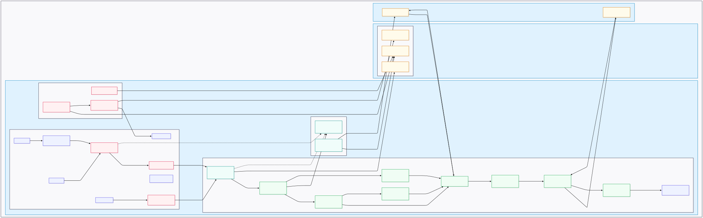

# 🏛️ CropCare AI — Detailed System Architecture

CropCare AI is designed as a secure Hybrid Multimodal Agricultural Intelligence Platform with layered perception, reasoning, localization, observability, and multilingual interaction capabilities.

The architecture combines:

* Deep Learning Computer Vision
* Multimodal Vision Intelligence
* Cognitive LLM Reasoning
* Retrieval-Augmented Generation
* Regional Agricultural Intelligence
* Production-Grade Observability
* Multi-Container Docker Orchestration
* Persistent PostgreSQL State

---

# 🌱 High-Level Architecture Philosophy

Traditional agricultural AI systems often rely entirely on a single LLM.

This creates several problems:

❌ weak visual classification
❌ hallucinated diagnoses
❌ inconsistent treatment generation
❌ poor explainability

CropCare AI solves this by utilizing a highly decoupled pipeline:

| Intelligence Layer | Responsibility                       |
| ------------------ | ------------------------------------ |
| Perception Layer   | Visual disease recognition           |
| Translation Layer  | Image-to-text symptom conversion     |
| Reasoning Layer    | Disease verification and explanation |
| Knowledge Layer    | RAG-based factual grounding          |
| Advisory Layer     | Regional adaptation and treatment    |
| Infrastructure     | Dockerized Web & DB Containers       |

---

# 🧠 Full Hybrid Pipeline Architecture



---

# 🤖 Collaborative Multi-Agent Pipeline & Data Flow

CropCare AI leverages a state-managed, highly collaborative Multi-Agent orchestration design coordinated by the central pipeline manager (`src/orchestrator.py`):

```text
[User Input] ➡️ [Safety Shield] ➡️ [Orchestrator Core]
                                         │
                 ┌───────────────────────┴───────────────────────┐
                 ▼                                               ▼
       [Local MobileNetV2 CNN]                         [Symptom Agent (Gemini)]
     (Disease & Crop Classifier)                     (Detailed Visual Feature Text)
                 │                                               │
                 └───────────────────────┬───────────────────────┘
                                         ▼
                             [Pathfinder Agent (Llama)]
                           (Cross-References ChromaDB RAG)
                                         │
                                         ▼
                            [Treatment Agent (Llama)]
                          (Prescribes Chemical & Organic)
                                         │
                                         ▼
                             [Regional Agent (Llama)]
                            (Threat Adaptation & Local)
                                         │
                                         ▼
                            [Translation Layer (Llama)]
                                         │
                                         ▼
                               [TTS Audio Output]
```

### Sequential Execution Flow:
1. **Gatekeeper Validation**: The **Gatekeeper Agent** (Gemini 2.5 Flash Vision) acts as a strict cognitive shield. If a user uploads an image, the Gatekeeper validates whether the contents contain plant leaves, stems, crops, pests, or agricultural soil. Any non-agricultural image is rejected instantly.
2. **Dual-Path Parallel Perception**:
   - The image flows to the **Local PyTorch MobileNetV2 CNN** for rapid, local deep learning disease and crop prediction.
   - Concurrently, the **Symptom Agent** (Gemini 2.5 Flash Vision) acts as a visual translation expert, transforming raw visual symptoms into rich, descriptive text (e.g., *leaf margins showing yellow halos*).
   - *Resilience Fallback*: If the local PyTorch model encounters an error, the pipeline gracefully triggers the **Zero-Shot Gemini Vision fallback**.
3. **Factual Verification (The Pathfinder)**: 
   - The **Pathfinder Agent** receives the CNN prediction and the Symptom Agent's visual description.
   - It queries the **ChromaDB Disease Knowledge Base** using semantic embeddings (`all-MiniLM-L6-v2`) to verify the diagnosis against grounded factual data sheets.
4. **Treatment Generation**:
   - The verified diagnosis is handed off to the **Treatment Agent**, which builds a rigorous, day-by-day chemical or organic remediation protocol.
5. **Regional Adaptation**:
   - The treatment protocol is passed to the **Regional Agent**, which performs a secondary RAG query against the **ChromaDB Regional Knowledge Base** to customize the advice for local microclimates.
6. **Translation & Speech**:
   - The finalized advice is translated into the user's preferred language (English, Hindi, or Tamil) and made playable via Text-To-Speech (TTS).

---

# 👁️ Deep Learning Perception Layer

## MobileNetV2 CNN Classifier

### File

```text
src/disease_classifier.py
```

### Responsibilities

The CNN classifier is responsible for:

* crop classification
* disease recognition
* confidence estimation
* fast local inference

Unlike LLMs, CNNs are specialized for:

✅ visual feature extraction
✅ spatial pattern learning
✅ image classification

---

## Why CNN Instead of Pure LLM Vision?

LLMs are excellent at:

* reasoning
* explanation
* summarization
* language synthesis

However, specialized CNNs outperform LLMs for:

* fine-grained plant disease classification
* lesion pattern recognition
* visual agricultural pathology

This is why CropCare AI separates:

```text
Perception ≠ Reasoning
```

---

# 🌉 Multimodal Translation Layer

## Vision Gatekeeper & Symptom Agent

### Files

```text
src/vision_agent.py
src/symptom_agent.py
```

### Purpose

To ensure the pipeline only processes relevant agricultural inputs and to bridge the gap between visual data and text-only LLMs.

**1. Gatekeeper Agent:** Validates the uploaded image to ensure it is actually a plant or crop, rejecting irrelevant images (like animals or faces) before costly processing occurs.
**2. Symptom Agent:** Acts as a multimodal translator that converts:

```text
Image → Structured Agronomic Symptoms
```

Example:

```text
Brown necrotic lesions with yellow chlorotic halos.
```

This decoupled approach creates a robust bridge between visual intelligence and text reasoning systems.

---

# 🧠 Cognitive Reasoning Layer

## Pathfinder Agent

### File

```text
src/disease_agent.py
```

### Responsibilities

The Pathfinder Agent:

* validates CNN predictions
* reasons over symptom descriptions
* retrieves RAG context
* generates agronomist explanations
* verifies disease consistency

This transforms the system from:

```text
simple classifier
```

into:

```text
explainable agricultural intelligence
```

---

# 📚 Retrieval-Augmented Generation Layer

## ChromaDB Knowledge System

The RAG layer stores:

* disease literature
* treatment protocols
* prevention methods
* crop pathology data

This reduces hallucinations and grounds outputs in factual agricultural information.

---

# 💊 Treatment Intelligence Layer

## Treatment Agent

### File

```text
src/treatment_agent.py
```

### Responsibilities

* generate organic treatments
* generate chemical recommendations
* provide recovery protocols
* suggest preventive practices

---

# 🌍 Regional Intelligence Layer

## Regional Agent

### File

```text
src/regional_agent.py
```

### Responsibilities

* adapt recommendations to local weather
* account for environmental risk
* provide localized agricultural advice

---

# ⚡ Observability & Metrics Architecture

CropCare AI includes a full observability system.

The orchestrator tracks:

| Metric                   | Description                       |
| ------------------------ | --------------------------------- |
| cv_inference_sec         | CNN prediction latency            |
| symptom_analysis_sec     | Gemini symptom extraction latency |
| disease_reasoning_sec    | Groq reasoning + RAG latency      |
| treatment_generation_sec | Treatment synthesis latency       |
| regional_analysis_sec    | Regional advisory latency         |
| total_pipeline_sec       | End-to-end execution latency      |

---

# 🌐 Multilingual & Voice Architecture

CropCare AI includes multilingual conversational support.

## Supported Languages

| Language | Support |
| -------- | ------- |
| English  | ✅       |
| Tamil    | ✅       |
| Hindi    | ✅       |

The preferred language is stored persistently and applied throughout the conversation lifecycle.

---

## Voice Pipeline

The system supports:

* speech-to-text conversion
* multilingual voice queries
* text-to-speech output generation

Voice inputs are converted into structured agricultural prompts before entering the orchestration pipeline.

---

# 🔐 Authentication Architecture & Data Mapping

CropCare AI includes a highly secure, production-grade authentication workflow utilizing parameterized SQLAlchemy ORM connections.

## Database Schema (`src/db.py`)

* **`users`**: Contains IDs, unique usernames, Bcrypt-hashed credentials, roles, and registration dates.
* **`chats`**: Tracks session metadata linked directly to a unique authenticated `user_id`.
* **`messages`**: Stores conversation transcripts and optional base64-encoded speech-to-text voice records.

## Login & Signup System

Features:

* **Bcrypt Cryptography**: Passwords are mathematically salted and hashed; raw passwords are never stored.
* **Persistent PostgreSQL State**: User data, roles, and isolated chat sessions are managed securely in the relational DB.
* **Session Isolation**: Chat history is strictly bound to the authenticated user's session ID.

## Shared Secret Registration Gate

To create an account, users must provide a valid application shared secret (`APP_SECRET`).

This mechanism protects:

* API credits
* AI infrastructure
* unauthorized registrations
* malicious automation

---

# 🐳 Deployment Architecture

CropCare AI utilizes a robust **Docker Compose** containerized environment.

The system is split into multiple isolated services running over a dedicated bridge network:

1. **Web Container**: Runs the Streamlit frontend and orchestrates the AI pipeline.
2. **Database Container**: Runs the PostgreSQL persistent database for user and session management.

The system includes:

* `Dockerfile` for the Streamlit web service
* `docker-compose.yml` for orchestrating the multi-container environment
* production-safe configurations
* environment-based secret management (`.env`)

---

# 📈 System Resilience & Failover Policy

* **API Retries (`src/api_resilience.py`)**: Leverages `tenacity` retry loops with exponential backoff to handle network throttling, rate limiters, or transient external API crashes gracefully.
* **Graceful Degradation**: 
  * If a CNN prediction is ambiguous, the cognitive agents default to symptom-based RAG matching.
  * If external Vision APIs drop, the pipeline degrades elegantly to text-only diagnostics.

---

## 🛡️ Production Readiness Audit (13 Pillars)

While the agents provide the intelligence, the following 13 pillars provide the **stability and security**:

1.  **Deterministic Safety**: Keywords + LLM-based filtering.
2.  **Docker Orchestration**: Containerized multi-service deployment.
3.  **Bcrypt Security**: Cryptographically hashed passwords.
4.  **Schema Validation**: Pydantic models for all data exchange.
5.  **App Access Gate**: `APP_SECRET` required for registration.
6.  **Generic Error Handling**: Sanitized user-facing exceptions.
7.  **Persistent State**: PostgreSQL via SQLAlchemy.
8.  **Agent Loop Guard**: `MAX_STEPS` prevents infinite reasoning loops.
9.  **Context Management**: Automatic history slicing and summarization.
10. **Rate Limiting**: Sliding-window 10 requests/min per user.
11. **SQL Sanitization**: 100% parameterized queries.
12. **Media Cleanup**: Automated purging of temp files.
13. **Singleton/Factory**: Centralized resource management in `src/factory.py`.

---

# 🎯 Architectural Summary

CropCare AI is not simply a chatbot.

It is a:

```text
Hybrid Multimodal AI Orchestration System
```

where:

* CNNs specialize in perception
* Gemini specializes in multimodal translation and validation
* Groq specializes in reasoning
* ChromaDB specializes in factual grounding
* Orchestrator specializes in coordination and observability
* Docker & PostgreSQL specialize in robust deployment and state management

This separation of intelligence responsibilities creates a significantly more scalable and production-oriented AI architecture.
